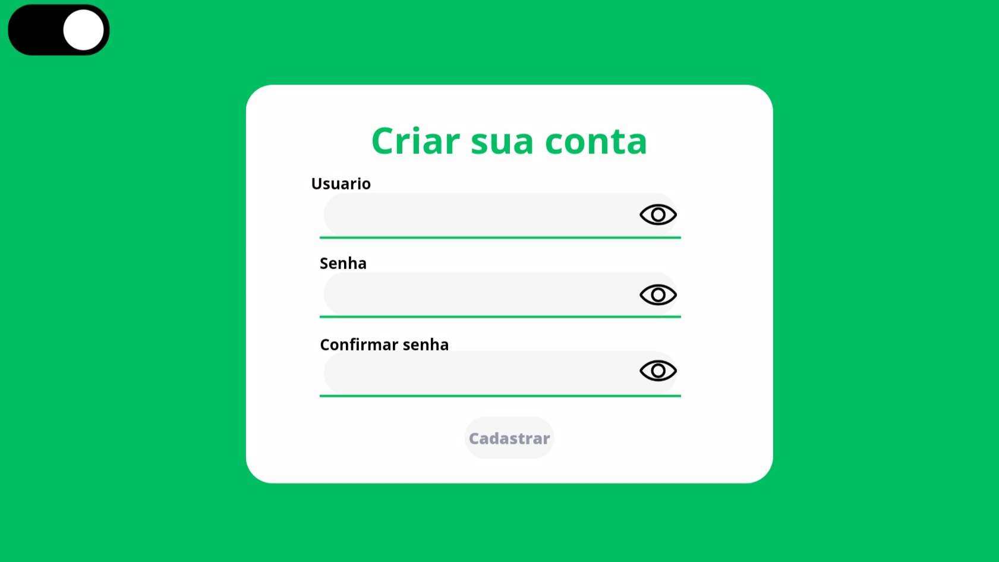

# Informações do Projeto
`TÍTULO DO PROJETO`  

Preço Certo - Grupo: Comprar Barato

`CURSO` 

Ciência da Computação.

## Participantes

Os mebros do grupo são:
- André Luis de Oliveira
- Caio Barcala
- Felipe Carvalho
- Guilherme Oliveira
- Vitor Marcolino

# Estrutura do Documento

- [Informações do Projeto](#informações-do-projeto)
  - [Participantes](#participantes)
- [Estrutura do Documento](#estrutura-do-documento)
- [Introdução](#introdução)
  - [Problema](#problema)
  - [Objetivos](#objetivos)
  - [Justificativa](#justificativa)
  - [Público-Alvo](#público-alvo)
- [Especificações do Projeto](#especificações-do-projeto)
  - [Personas, Empatia e Proposta de Valor](#personas-empatia-e-proposta-de-valor)
  - [Histórias de Usuários](#histórias-de-usuários)
  - [Requisitos](#requisitos)
    - [Requisitos Funcionais](#requisitos-funcionais)
    - [Requisitos não Funcionais](#requisitos-não-funcionais)
  - [Restrições](#restrições)
- [Projeto de Interface](#projeto-de-interface)
  - [User Flow](#user-flow)
  - [Wireframes](#wireframes)
- [Metodologia](#metodologia)
  - [Divisão de Papéis](#divisão-de-papéis)
  - [Ferramentas](#ferramentas)
- [**############## SPRINT 1 ACABA AQUI #############**](#-sprint-1-acaba-aqui-)
- [Projeto da Solução](#projeto-da-solução)
  - [Tecnologias Utilizadas](#tecnologias-utilizadas)
  - [Arquitetura da solução](#arquitetura-da-solução)
- [Avaliação da Aplicação](#avaliação-da-aplicação)
  - [Plano de Testes](#plano-de-testes)
  - [Registros de Testes](#registros-de-testes)
- [Referências](#referências)

# Introdução

## Problema

Ao utilizarmos a Matriz CSD do Design Thinking, chegamos a conclusão que o problema principal que nossa aplicação deve resolver é a dificuldade de realizar compras online com o melhor preço.

## Objetivos

O objetivo geral da nossa aplicação é tornar mais simples as compras onlines por preços acessíveis. Além de resolver o problema, nossa aplicação também visa contribuir para que as compras aconteçam de forma segura e prática, como objetivos específicos.

## Justificativa

A aplicação é importante para consumidores digitais pois, segundo resultados de nossas entrevistas qualitativas com alguns dos mesmos, há uma constante dificuldade de achar um produto que tenha um preço favorável e uma confiabilidade no vendedor que está oferecendo o produto. Então como solução, pensamos em fazer com que haja uma forma simples e rápida de demonstrar o melhor preço com segurança por parte do vendedor, em um design mais limpo e simples de usar, os objetivos específicos.

## Público-Alvo

Após a montagem de um Mapa de Stakeholders, a Preço Certo foi feita para ser utilizada por qualquer consumidor de lojas virtuais. Em questões de relação com tecnologia, a aplicação pode ser utilizada desde pessoas com baixo conhecimento de como navegar na internet à pessoas que utilizam diariamente. Além disso, no que diz respeito às relações hierárquicas, nossa aplicação atende desde quem necessita dos melhores preços para realizar uma compra à pessoas que só desejam economizar dinheiro.
 
# Especificações do Projeto

Para realizar as especificações do projeto, utilizamos a plataforma Miro, reunindo em equipe para produzir o Design Thinking da aplicação. Além disso, utilizamos o Figma e o Canva para fazer o Wireframe do projeto.

## Personas, Empatia e Proposta de Valor

As personas identificadas no projeto (Kennedy, Xaquira e Clayton) embora tenham objetivos diferentes para utilizar os produtos, todas têm em comum o desejo de economizar ao comprar equipamentos de trabalho ou produtos em geral e que essa compra seja feita de forma segura, sem precisar ter medo de fazer compras online.

## Histórias de Usuários

Com base na análise das personas forma identificadas as seguintes histórias de usuários:

|EU COMO... `PERSONA`| QUERO/PRECISO ... `FUNCIONALIDADE` |PARA ... `MOTIVO/VALOR`                 |
|--------------------|------------------------------------|----------------------------------------|
|Fã de jogos         | Comprar jogos da Nintendo baratos  | Poder satisfazer o hobby               |
|DJ de jogos digitais| Comprar computador gamer barato    | Produzir novas músicas                 |
|Vocalista de banda  | Comprar um microfone barato        | Melhorar a performance musical         |

## Requisitos

As tabelas que se seguem apresentam os requisitos funcionais e não funcionais que detalham o escopo do projeto.

### Requisitos Funcionais

|ID    | Descrição do Requisito  | Prioridade |
|------|-----------------------------------------|----|
|RF-001| Permitir que o usuário cadastre e logue | ALTA | 
|RF-002| Barra de pesquisa de produtos           | ALTA |
|RF-003| Trocar temas de cor                     | MÉDIA |

### Requisitos não Funcionais

|ID     | Descrição do Requisito  |Prioridade |
|-------|-------------------------|----|
|RNF-001| O sistema deve ser responsivo para rodar em um dispositivos móvel | MÉDIA | 
|RNF-002| Design limpo                                                      | MÉDIA |
|RNF-003| Tabela de  confiabilidade de lojas                                | ALTA  |
|RNF-004| Página de detalhes do produto                                     | MÉDIA |

## Restrições

O projeto está restrito pelos itens apresentados na tabela a seguir.

|ID| Restrição                                             |
|--|-------------------------------------------------------|
|01| O projeto deverá ser entregue até o final do semestre |
|02| Não pode ser desenvolvido um módulo de backend        |
|03| Não temos APIs funcionais                             |

# Projeto de Interface

As interfaces da Preço Certo foram criadas para incluir todos os requisitos, porém, com um design simples que facilite a compra. Assim ajudando pessoas como a persona Xaquira, que tem dificuldades na hora de comprar online. As principais interfaces são: a tela de pesquisa, a tela do produto, a tela de login e a tela de cadastro.

## User Flow

## Wireframes

A tela inicial consta com a barra de pesquir para encontrar os produtos, um botão para login ou cadastro do usuario e acesso à tabela de confiabilidade.

A tela de detalhes mostra outras imagens do produto, seu nome e a variação do preço.

A Tela de Confiabilidade mostra uma tabela com reviews dos principais sites de lojas online.

São telas que permitem ao usuário entrar com informações para criar uma contra e depois poder acessar o site com essa conta.

# Metodologia

A equipe se juntou para reunir as informações iniciais de Design Thinking (Matriz CSD, Mapa de Stakeholders, Entrevistas Qualitativas, identificação de Personas e Brainstorming) na plataforma Miro e a construção do wirframe no site Figma. Após construir a ideia do projeto, cada membro foi divido no trello (kamban) com duas tarefas para serem realizadas utilizando Repl.it ou Visual Studio Code. A comunicação para organizar a procedência do projeto foi feita pela rede social WhatsApp.

## Divisão de Papéis

- André Luis: Criação da página do produto e aprimoramento.
- Caio Barcala: Configuração do CSS da tela inicial da página e reconfiguração
- Felipe Carvalho: HTML da página inicial do site
- Guilherme Oliveira: Página de login e cadastro funcionais e botão troca tema.
- Vitor Marcolino: Criação de uma ferramenta para checar a confiabilidade de lojas virtuais.

## Ferramentas

......  COLOQUE AQUI O SEU TEXTO - SIGA O EXEMPLO DA TABELA ABAIXO  ......

| Ambiente  | Plataforma              |Link de Acesso |
|-----------|-------------------------|---------------|
|Processo de Design Thinkgin  | Miro |  https://miro.com/app/board/uXjVMYCYaQg=/ | 
|Repositório de código | GitHub | https://github.com/ICEI-PUC-Minas-PPLCC-TI/ti-1-ppl-cc-m2-20231-comprar-barato | 
|Protótipo Interativo | Figma | https://www.figma.com/file/Ems8INDvhGlNasNTtmDuUm/Design-Thinking?type=design&node-id=0-1&mode=design&t=SbGDOML1uwIVi6Uu-0 |
|Wireframe teste | Canva | https://www.canva.com/design/DAFgkz9eFxI/cjcWLyC7eANceUWdviaaDw/edit?utm_content=DAFgkz9eFxI&utm_campaign=designshare&utm_medium=link2&utm_source=sharebutton |
|Hospedagem | Replit | https://replit.com |

# Projeto da Solução

Criação de um site em conjunto com uma API tendo como função procurar entre outros sites e analisar tanto a confiança do site como também o seu preço até achar o mais favorável.

## Tecnologias Utilizadas

Para resolver o problema, nossa equipe criou um site utlizando as linguagens HTML, CSS e JavaScript usando as ferramentas "Repl.it" e "Visual Studio Code".

Organização do Design Thinking.

Fluxo de telas que podem ser acessadas pelo usuário.

## Plano de Testes

Os cenários que esperamos que seja positivos é o login e cadastro funcionais, barra de pesquisa funcional e que a mudança de tela para tela de produto também ocorra de forma correta

## Registros de Testes

Em pontos positivos nosso site tem uma interface simples e com coloração “agradável”. 
Em nossos pontos negativos a criação de uma API capaz de ser criar e/ou acionada ainda é complexa, pois não temos o conhecimento suficiente para sua criação.

# Referências

- [Justificativa](https://medium.com/@versioparole/objetivos-problema-de-pesquisa-e-justificativa-c98c8233b9c3)
- [Justificativa](https://guiadamonografia.com.br/como-montar-justificativa-do-tcc/)